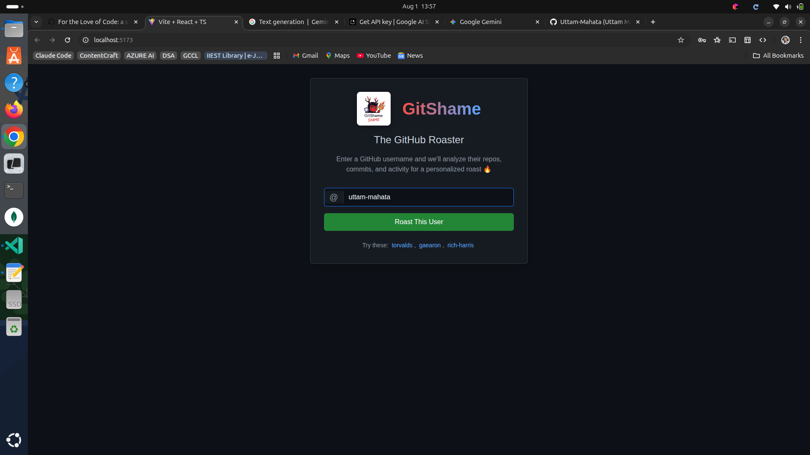
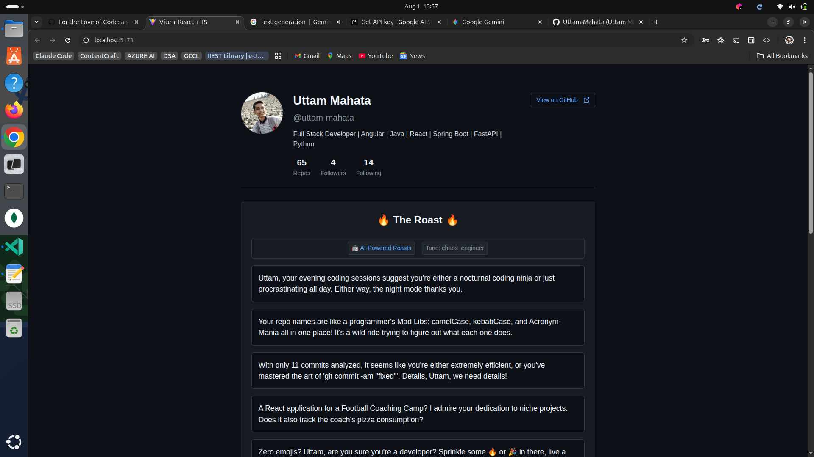
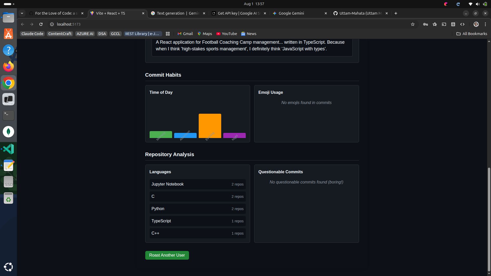

# GitShame 🔥

> **The GitHub Roaster** - Analyze GitHub profiles and serve personalized roasts with AI-powered wit!

GitShame is a full-stack web application that analyzes GitHub users' coding patterns, repository organization, and commit habits to generate humorous, personalized "roasts" using Google's Gemini AI with structured output.

## 🤔 What Does It Do?

GitShame transforms the mundane task of GitHub profile analysis into an entertaining experience by:

- **🔍 Deep Profile Analysis**: Examines commit patterns, repository names, coding habits, and activity timelines
- **🤖 AI-Powered Roasting**: Uses Google Gemini 2.0 Flash to generate clever, personalized roasts based on actual data
- **📊 Visual Insights**: Creates interactive charts showing when you code, what languages you use, and your questionable commit messages
- **🎭 Personality Profiling**: Categorizes developers into personas like "Night Owl Coder," "Commit Message Poet," or "Repository Hoarder"

## 🎯 Why I Built GitShame

As developers, we spend countless hours crafting perfect code, but our GitHub profiles tell the *real* story:

- **😅 The 3 AM commits** that somehow work better than daytime code
- **📝 Commit messages** that range from Shakespeare to "fix stuff"  
- **🗂️ Repository names** that sound like either AI projects or sandwich ingredients
- **📈 Coding patterns** that reveal we're either productivity ninjas or professional procrastinators

I built GitShame because:

1. **Developer Culture**: Our coding quirks deserve celebration, not judgment
2. **AI Integration**: Wanted to experiment with Google Gemini's structured output capabilities
3. **Full-Stack Practice**: Perfect project to combine React TypeScript frontend with FastAPI backend
4. **Community Fun**: Give developers a lighthearted way to share and laugh about their coding habits

GitShame turns GitHub analytics into entertainment while showcasing real technical skills in AI integration, data visualization, and modern web development.


## 📸 Demo Screenshots

### 🏠 Home Page - Search Interface

*Clean, GitHub-inspired search interface with custom GitShame branding*

### 👤 Profile Analysis - AI Roasts in Action

*Real-time AI-powered roast generation with user profile display*

### 📊 Insights Dashboard - Commit Patterns & Analysis

*Interactive charts showing commit habits, language usage, and coding patterns*


## ✨ Features

- 🤖 **AI-Powered Roasts**: Uses Google Gemini 2.0 Flash with structured output for clever, personalized roasts
- 📊 **GitHub Analysis**: Deep analysis of commit patterns, repo organization, and coding habits
- 🔄 **Smart Fallbacks**: Multiple fallback layers ensure users always get roasted
- 🎨 **Modern UI**: Clean, responsive React interface with GitHub-inspired styling
- ⚡ **Fast API**: RESTful FastAPI backend with comprehensive error handling
- 🛡️ **Type Safety**: Full TypeScript implementation with proper error boundaries
- 🌐 **CORS Ready**: Properly configured for development and production
- 📈 **Visual Analytics**: Interactive charts for commit timing and language usage
- 🔍 **Smart Search**: GitHub username validation with helpful suggestions
- 💡 **Roast Categories**: Organized roasts by coding habits, repo patterns, and more

*See all features in action in our [demo screenshots](#-demo-screenshots)!*

## 🏗️ Architecture

```
┌─────────────────┐    GitHub API     ┌──────────────────┐
│   React Client  │ ─────────────────→ │  GitHub Servers  │
│   (Frontend)    │                    └──────────────────┘
└─────────────────┘
         │
         │ REST API Calls
         ▼
┌─────────────────┐    Gemini API     ┌──────────────────┐
│  FastAPI Server │ ─────────────────→ │  Google Gemini   │
│   (Backend)     │                    │      AI          │
└─────────────────┘                    └──────────────────┘
```

## 🚀 Quick Start

### Prerequisites

- **Python 3.8+** with pip
- **Node.js 16+** with npm
- **Gemini API Key** from [Google AI Studio](https://aistudio.google.com/app/apikey)

### Installation

1. **Clone the repository**
   ```bash
   git clone https://github.com/Uttam-Mahata/gitshame.git
   cd gitshame
   ```

2. **Setup Backend**
   ```bash
   cd server
   python -m venv venv
   source venv/bin/activate  # Windows: venv\Scripts\activate
   pip install -r requirements.txt
   
   # Configure environment
   cp .env.example .env
   # Edit .env and add your GEMINI_API_KEY
   ```

3. **Setup Frontend**
   ```bash
   cd ../client
   npm install
   ```

4. **Start Development Servers**
   
   **Terminal 1 - Backend:**
   ```bash
   cd server
   source venv/bin/activate
   python main.py
   # Server: http://localhost:8000
   ```
   
   **Terminal 2 - Frontend:**
   ```bash
   cd client
   npm run dev
   # Client: http://localhost:5173
   ```

5. **Open your browser** → `http://localhost:5173`

## 📱 Usage

### Getting Started
1. **Enter a GitHub username** in the search box (see [Home Demo](#-home-page---search-interface))
2. **Wait for analysis** - The app fetches and analyzes the user's data
3. **Get roasted!** - Enjoy AI-generated, personalized roasts (see [Profile Demo](#-profile-analysis---ai-roasts-in-action))
4. **View insights** - Check commit patterns and coding habits (see [Analysis Demo](#-insights-dashboard---commit-patterns--analysis))

### Example Usernames to Try
- `uttam-mahata` - Full Stack Developer (Featured in demo!)
- `torvalds` - Linux creator
- `gaearon` - React core team
- `rich-harris` - Svelte creator
- Your own username!

## 🛠️ Development

### Project Structure

```
gitshame/
├── client/                 # React TypeScript frontend
│   ├── src/
│   │   ├── api/           # API clients and services
│   │   ├── components/    # React components
│   │   ├── styles/        # CSS stylesheets
│   │   └── main.tsx       # Entry point
│   ├── package.json
│   └── README.md
├── server/                 # FastAPI Python backend
│   ├── main.py           # FastAPI application
│   ├── requirements.txt  # Dependencies
│   ├── .env.example      # Environment template
│   └── README.md
└── README.md              # This file
```

### Tech Stack

**Frontend:**
- React 18 with TypeScript
- Vite for build tooling
- Axios for HTTP requests
- Custom CSS with GitHub-inspired design

**Backend:**
- FastAPI with Python 3.8+
- Google Gemini AI integration
- Pydantic for data validation
- CORS middleware for cross-origin requests

**External APIs:**
- GitHub REST API v3
- Google Gemini 2.0 Flash

## 🔧 Configuration

### Environment Variables

**Backend (`.env`):**
```env
GEMINI_API_KEY=your_gemini_api_key_here
PORT=8000
HOST=0.0.0.0
DEBUG=True
FRONTEND_URL=http://localhost:5173
```

**Frontend (built-in config):**
- API Base URL: `http://localhost:8000`
- Request timeout: 30 seconds
- Retry attempts: 3

## 📖 API Documentation

### Backend Endpoints

- `GET /` - API status and information
- `GET /health` - Health check
- `POST /generate-roasts` - Generate AI roasts
- `POST /analyze-roast-potential` - Analyze roastability score

**Interactive API Docs:** `http://localhost:8000/docs`

### Frontend API Services

- `githubAPI` - GitHub data fetching
- `apiClient` - Backend communication
- `analyzer` - Data analysis and roast generation

## 🎯 Roast Categories

The AI generates roasts in several categories:

- **Coding Habits**: Commit timing, patterns, frequency
- **Repository Patterns**: Naming conventions, organization
- **Commit Messages**: Quality, length, questionable content
- **Social Metrics**: Followers, stars, engagement
- **General**: Overall developer personality

## 🔀 Fallback System

1. **Primary**: AI-generated roasts from Gemini
2. **Secondary**: Backend static roasts
3. **Tertiary**: Frontend emergency roasts

## 🚨 Error Handling

- GitHub API rate limiting
- Network connectivity issues
- AI service unavailability
- Invalid usernames
- CORS configuration

## 🧪 Testing

```bash
# Backend tests
cd server
python test_api.py
python integration_test.py

# Frontend tests
cd client
npm test
```

## 🤝 Contributing

1. Fork the repository
2. Create a feature branch (`git checkout -b feature/amazing-feature`)
3. Commit your changes (`git commit -m 'Add amazing feature'`)
4. Push to the branch (`git push origin feature/amazing-feature`)
5. Open a Pull Request

## 📋 Roadmap

- [ ] User authentication and saved roasts
- [ ] Social sharing functionality  
- [ ] Organization/team analysis
- [ ] Historical trend analysis
- [ ] Custom roast templates
- [ ] Multi-language support

## 🐛 Known Issues

- GitHub API rate limits may affect heavy usage
- AI generation can be slow during peak times
- Some private repos aren't accessible

## 📄 License

This project is licensed under the MIT License - see the [LICENSE](LICENSE) file for details.

## 🙏 Acknowledgments

- **GitHub API** for providing comprehensive user data
- **Google Gemini** for AI-powered roast generation
- **React & FastAPI** communities for excellent frameworks

## 📞 Support

- **Issues**: [GitHub Issues](https://github.com/Uttam-Mahata/gitshame/issues)
- **Discussions**: [GitHub Discussions](https://github.com/Uttam-Mahata/gitshame/discussions)

---
